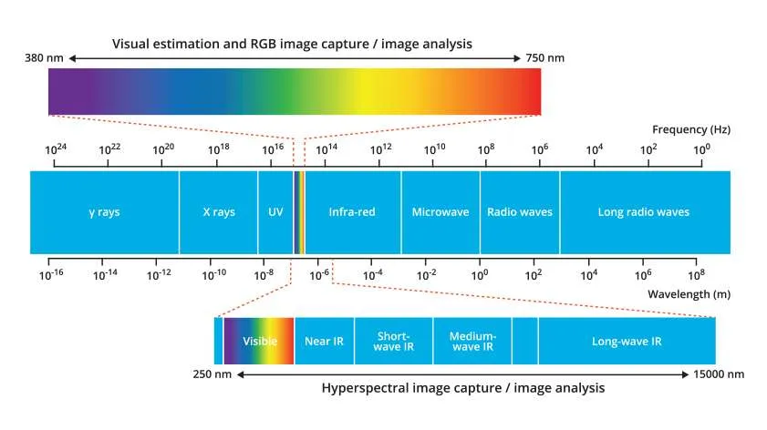
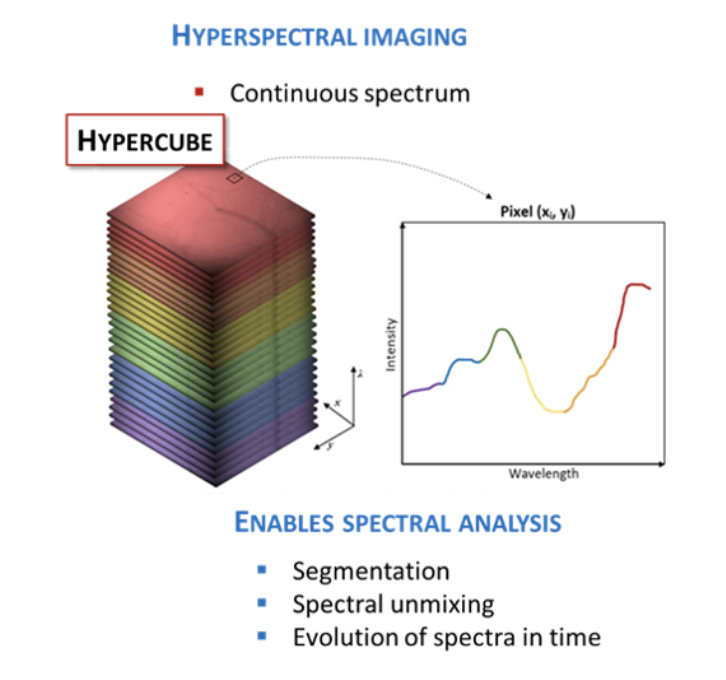
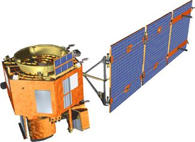
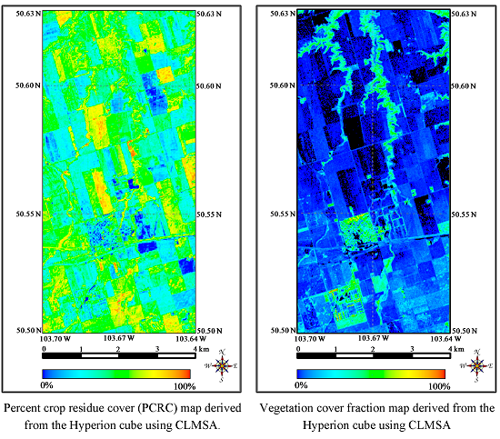
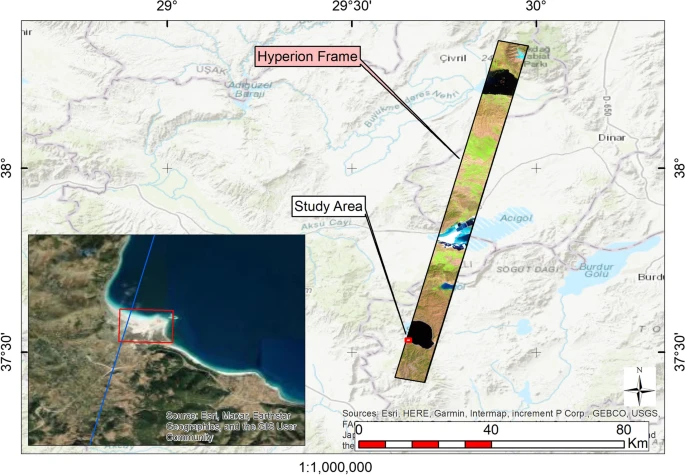

```{r xaringan-extra, include=FALSE}
library(xaringanExtra)
xaringanExtra::use_search()
```

```{r setup, include=FALSE}
options(htmltools.dir.version = FALSE)
```

```{r echo=FALSE}
xaringanExtra::use_panelset()
```

## A significant advancement in spectral imaging

.panelset[
.panel[.panel-name[Spectral resolution]

<div style="font-size: 1.2em; line-height: 1.6;">
    <p style="margin: 0 0 20px 0; text-align: left; font-size:18px;">
      The ability of a sensor to distinguish between different wavelengths of light across the electromagnetic spectrum.
    </p>
  </div>

<div style="display: flex; align-items: flex-start; gap: 20px; font-size: 13px;">
  <div style="flex: 1;">
  <figure style="margin: 0; text-align: center;">
    
         <figcaption { margin-top: 5px; }>
    Source: <a href="https://www.specim.com/technology/what-is-hyperspectral-imaging/">specim.com</a>
    </figcaption>
    </figure>
  </div>

  <div style="flex: 1;">
    <ul style="margin: 0; padding-left: 20px; font-size: 18px;">
      <li>The centre area of the image is the full electromagnetic spectrum</li>
      <li>The top bar <strong>visible light</strong> is the part of the spectrum our eyes can see and standard cameras can capture</li>
      <li>The final bar shows the range of the EM spectrum that can be captured by hyperspectral sensors</li>
    </ul>
  </div>

</div>]

.panel[.panel-name[Hyperspectral Imagery (HSI)]

<div style="display: flex; align-items: flex-start; gap: 20px; font-size: 13px;">
  <div style="flex: 1;">
  <figure>
    
    <figcaption>Source:<a href=https://nireos.com/application/what-is-hyperspectral-imaging/>Nireos</a>
  </div>

  <div style="flex: 1;">
    <ul style="margin: 0; padding-left: 20px; font-size: 18px;">
      <li>HSI is a technique that collects and analyses data across the electromagnetic spectrum to produce images with a high spectral resolution.</li>
      <li>It involves using a hyperspectral camera (an imaging spectrometer) to capture pictures where each pixel not only shows color but also contains detailed spectral information, revealing what things are made of.</li>
      <li>HSI captures HUNDREDS sometimes THOUSANDS of narrow neighboring spectral bands.</li>
    </ul>
  </div> 
  </div>]

.panel[.panel-name[Strengths and Limitations]

<ul style="margin: 0; padding-left: 20px; font-size: 23px;">
      <li style="color:green;">Hyperspectral sensors capture detailed data that reveal the unique spectral fingerprints of different materials.</li>
      <li style="color:green;">Spectral information could be combined with the spatial context of surrounding pixels in hyperspectral images resulting in improved segmentation and classification accuracy.
</li>
      <li style="color:red;">However: high spectral resolution demands greater computing power, more complex data processing, and specialised expertise to interpret results.</li>
    </ul>

]]
---

### Using Hyperspectral Imaging to Detect and Measure Peripheral Artery Disease
<div style="display: flex; align-items: flex-start; gap: 30px;">

  <!-- Left column: image + caption -->
  <div style="flex: 1; text-align: center;">
    
    <p style="font-size:14px; margin-top:8px;">
      Displays imaging comparisons, highlighting reduced oxyhemoglobin and deoxyhemoglobin 
      levels in PAD-affected feet (Image Chin et al., 2011).
    </p>
  </div>

  <!-- Right column: bullet points -->
  <div style="flex: 1; font-size: 23px;">
    <ul>
      <li>Peripheral artery disease affects millions of people globally</li>
      <li>Earlier diagnosis is necessary to avoid unnecessary complications</li>
      <li>126 patients took part in this study</li>
      <li>Results displayed that hyperspectral imaging can detect PAD and evaluate disease severity</li>
    </ul>
  </div>

</div>

---

## What is Hyperion?

Hyperion is a hyperspectral sensor that enables scientists to see the chemical constituents of the Earth’s surface in fine detail (spatial resolution of 30m).

It captures high-resolution spectral data (220 spectral bands) across the visible to shortwave infrared spectrum (400–2500 nm).

NASA's EO-1 (Earth Observing-1) satellite carried Hyperion when it was launched in 2000.

EO-1 was Initially meant to be a 1 year satellite mission, however was extended due to its sensors providing valuable data for scientific research. 

Decommissioned in 2017 as it did not have enough fuel to stay in orbit. 


<div style="text-align: center;">
  
  
  <p>
     EO-1 Satellite (Image: <a href="https://eospso.nasa.gov/missions/earth-observing-1#:~:text=The%20Earth%20Observing%20(EO%2D1,year%20and%20still%20collects%20data.">NASA</a>).</p>
     </div>
     
---

#### Spatial Variability Mapping of Crop Residue Using Hyperion (EO-1) Hyperspectral Data (Bannari et al., 2015)

<div style="display: flex; align-items: flex-start; gap: 30px;">

  <!-- Left: image -->
  <div style="flex: 1; text-align: center;">
    
  </div>

  <!-- Right: bullet points -->
  <div style="flex: 1; font-size: 20px;">
    <ul>
      <li>This paper explored Hyperion data with CLMSA to estimate crop residue cover in Saskatchewan, Canada</li>
      <li>Maintaining crop residue enhances soil structure and CO₂ fixation, while reducing erosion</li>
      <li>This were possible because of Hyperion’s high spectral resolution</li>
      <li><strong>Limitation:</strong> images were taken early in the season when residue was sparse, not capturing different growth stages</li>
    </ul>
  </div>

</div>

---

### The study of mineral distribution using Hyperspectral Hyperion data along the shores of Lake Salda/Turkiye (Akgül and Ural, 2024). 

<div style="display: flex; align-items: flex-start; gap: 30px;">

  <!-- Left: image -->
  <div style="flex: 1; text-align: center;">
    
  </div>

  <!-- Right: bullet points -->
  <div style="flex: 1; font-size: 17px;">
    <ul>
      <li>This study explores mineral locations near Lake Salda using Hyperion data</li>
      <li>Results suggested significant mineral compositions, including 35% trona and 26.3% ulexite</li>
      <li>Helps us better understand the area's geology</li>
      <li>A similar mineral composition has also been found on Mars</li>
      <li>Hyperion’s broad wavelength coverage enabled precise mineral identification</li>
      <li><strong>Limitation:</strong> Hyperion’s narrow 7.7 km swath would have required mosaicking for larger areas, introducing atmospheric and illumination inconsistencies</li>
    </ul>
  </div>

</div>

---

## Reflection

<ul style="font-size:20px">
      <li>Hyperion was an exceptional innovation in Earth observation with its hyperspectral capabilities.</li><br>
      <li>The sensor allowed researchers to explore various topics ranging from crop residue mapping in Saskatchewan to mineral identification near Lake Salda in Turkey, advancing knowledge in agriculture, geology, and planetary science.</li><br>
      <li> However, its long revist time (16 days) meant it was unable to capture crop residue accurately and may delay the detection of early signs of crop stress in agriculture (Lu et al., 2024)<li>
      <li>Overall, hyperspectral imaging sensors are expensive to develop and maintain, limiting accessibility. Likewise, while hyperions data was groundbreaking it is not necessary in many use cases.</li>
    </ul>

---

#### Referenes

Akgül, M.A., Ural, S. (2024) The study of mineral distribution using hyperspectral Hyperion data along the shores of Lake Salda/Türkiye. Environ Earth Sci 83, 219.

Bannari, A. et al. (2015) Spatial Variability Mapping of Crop Residue Using Hyperion (EO-1) Hyperspectral Data. Remote sensing (Basel, Switzerland), 7 (6), 8107–8127.

Chin, J. A., Wang, E. C., & Kibbe, M. R. (2011). ‘Evaluation of hyperspectral technology for assessing the presence and severity of peripheral artery disease’. Journal of Vascular Surgery, 54, (6), 1679–1688. 

EO-1 (earth observing-1) (no date) eoPortal. (https://www.eoportal.org/satellite-missions/eo-1#mission-capabilities, Accessed: 26 January 2025). 

EO-1 sensors (no date) USGS. Available at: https://www.usgs.gov/centers/eros/eo-1-sensors (Accessed: 23 January 2025). 

Hyperspectral imaging for Environmental Monitoring (2024) Specim. (https://www.specim.com/hyperspectral-imaging-applications/environmental-monitoring/, Accessed: 23 January 2025).

Lu, B., Dao, P. D., Liu, J., He, Y., & Shang, J. (2020). Recent Advances of Hyperspectral Imaging Technology and Applications in Agriculture. Remote Sensing, 12(16), 2659. https://doi.org/10.3390/rs12162659


---

#### Thanks!

Slides created via the R package [**xaringan**](https://github.com/yihui/xaringan).


